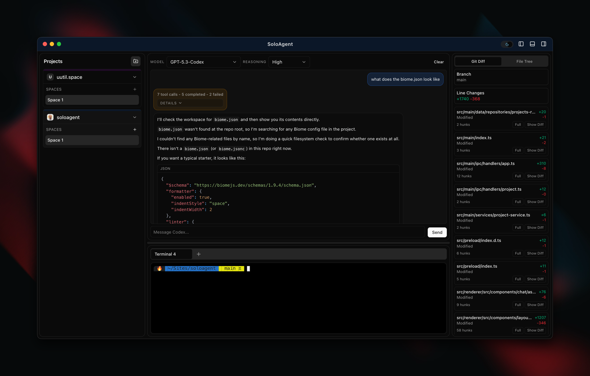
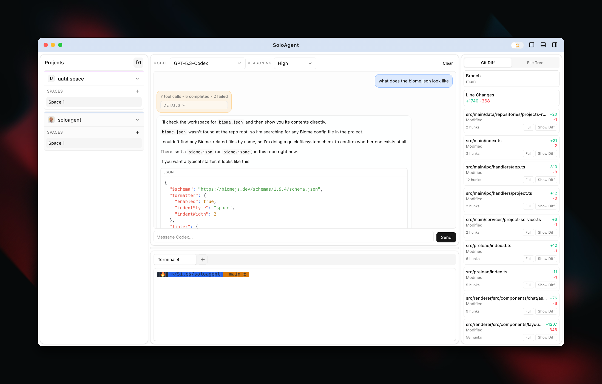
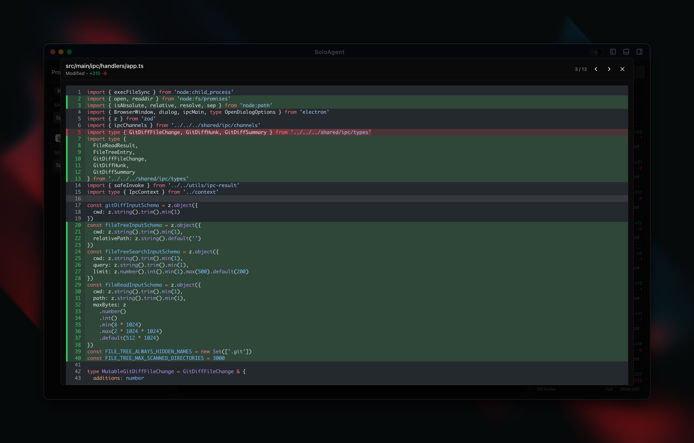

# SoloAgent


SoloAgent is a desktop app (Electron + React + TypeScript) for running coding workflows with per-project workspaces, per-space chat context, and live git visibility.

This README describes what the project currently is and how it is wired today.

## What's New in 0.1.0

- New app branding/logo wired into the project and packaging assets.
- Git Diff now includes an inline `Commit & PR Composer`:
  - Commit all changes with a user message, or auto-generate one when blank.
  - Create PRs with user-provided title/body, or auto-generate missing fields.
  - Preserves user drafts during diff polling and shows inline action status.
- PR creation is integrated with GitHub CLI (`gh`) including remote push + base branch detection.
- Codex process launching is more resilient in packaged builds by resolving executable paths from hydrated shell PATH.
- Terminal shell startup now uses login-shell semantics (`-l`) so tools from shell config (for example `pyenv`, `zoxide`) are available.
- App shutdown handling was hardened to improve close behavior and avoid PTY-related teardown crashes.

## Previews





## Current Product State

SoloAgent is a single dashboard app with an adaptive layout:

- Normal workspace mode:
  - Left panel: project list and per-project spaces.
  - Center panel:
    - Top: AI chat (Codex-backed completion, streaming UI, tool-call traces).
    - Bottom: terminal workspace (Ghostty Web + node-pty), with tabs and splits.
  - Right panel: tabbed insights (`Git Diff` first, `File Tree` second).
- No-project mode:
  - If Home is hidden and there are zero projects, only the left Projects panel is shown with an Add Project CTA.

## Current Capabilities

- Projects and Home scope
  - Add/select/remove local projects by root path.
  - Selected project persistence.
  - Built-in Home scope can be styled (logo/accent), removed, and kept hidden across restarts.
  - App supports having no selected project.
- Project settings
  - Rename project.
  - Upload/remove per-project logo.
  - Per-project accent color.
  - Rounded-square avatar uses logo when present, otherwise first-letter fallback.
  - Accent tint is applied to the active title bar and project card top strip.
- Spaces
  - Multiple spaces per scope, with rename/delete.
  - Terminal tabs are scoped to spaces.
  - Space/project activity indicators show when chat is actively streaming.
- Chat
  - Curated model picker with searchable dropdown.
  - Streaming assistant responses.
  - Tool calls shown inline as collapsed traces with detailed expandable blocks.
  - Tool call traces are persisted in chat history.
  - Ordering keeps tool traces above the assistant response they produced.
  - Chat history is scoped by project + space and stored in SQLite.
  - Virtualized message rendering for large histories.
- Terminal workspace
  - PTY-backed shell sessions via `node-pty`.
  - Ghostty Web terminal renderer.
  - Create tab, split pane, rename tab, close tab.
  - Terminal layouts are persisted/restored per scope.
- Git Diff insight
  - Branch and ahead/behind summary.
  - File-level status with additions/deletions and parsed hunk counts.
  - Includes tracked and untracked files (including files within untracked directories).
  - Expandable inline unified diff view.
  - Per-file patch loading on demand for faster initial diff load.
  - Untracked files can be opened in inline/full diff views.
  - Full-file diff modal with keyboard navigation.
  - Inline `Commit & PR Composer`:
    - Commit all changes (`git add -A`) with user-provided or auto-generated commit message.
    - Create PR via `gh pr create` with user-provided or auto-generated title/body.
    - Requires clean working tree for PR creation and auto-pushes current branch before PR.
    - Inline success/error/loading status feedback in the Git Diff panel.
- File Tree insight
  - Tabbed file browser in the right panel.
  - Expand/collapse directory tree with manual refresh.
  - Search files by path (debounced).
  - Git status badges on changed files (`M`, `A`, `D`, `R`, `C`, `T`, `!`, `U`) in both tree and search results.
  - `.gitignore`-aware tree/search filtering (`.git` also hidden).
  - File preview modal with syntax highlighting and line numbers.
  - Preview safeguards for binary files and large files (truncated preview).
- Window and UX
  - Custom frameless window chrome with native-like controls.
  - Light/dark theme toggle.
  - Native window background follows active theme/system theme to avoid white flashes on rapid resize.
  - Collapsible left, right, and terminal panels.
  - System zoom shortcuts enabled (`Cmd/Ctrl +`, `Cmd/Ctrl -`, `Cmd/Ctrl 0`) and menu zoom support.

## Tech Stack

- Desktop shell: Electron 39
- UI: React 19 + Tailwind CSS 4
- Build toolchain: electron-vite + TypeScript 5
- Terminal: `ghostty-web` + `node-pty`
- Chat UI/runtime: `@tanstack/ai`, `@tanstack/ai-react`, `@tanstack/ai-openai`
- Diff rendering: `@pierre/diffs`
- Persistence: SQLite (`node:sqlite`)
- State management: Zustand

## Architecture Overview

- `src/main`
  - Electron main process.
  - PTY lifecycle, project/config services, git diff collection.
  - Chat execution bridge to `codex exec` and chat history persistence.
- `src/preload`
  - Typed IPC bridge exposed as `window.api`.
- `src/renderer`
  - React UI (`DashboardLayout`) and feature components (chat, terminal, panels).
- `src/shared`
  - Shared IPC channels and TypeScript types used by main/preload/renderer.

## Persistence

- SQLite DB file: `${app.getPath('userData')}/soloagent.db`
- Current tables include:
  - `projects`
  - `app_settings`
  - `agent_profiles`
  - `chat_history_messages`
  - migration metadata and legacy tables
- `app_settings` also stores runtime preferences such as selected project, project logo/accent, and Home visibility.
- Renderer UI state also uses localStorage for some layout/split/space preferences.

## Requirements

- Node.js 22+ (this project uses `node:sqlite`).
- npm (scripts are defined with npm).
- Git installed (for git diff panel).
- GitHub CLI (`gh`) installed and authenticated (for PR creation from Git Diff panel).
- `codex` CLI installed and authenticated (for chat completions/tool calls).

## Getting Started

Install dependencies:

```bash
npm install
```

Run in development:

```bash
npm run dev
```

Typecheck:

```bash
npm run typecheck
```

Run tests:

```bash
npm run test
```

Run test coverage:

```bash
npm run test:coverage
```

Lint:

```bash
npm run lint
```

Build:

```bash
npm run build
```

Platform packaging:

```bash
npm run build:mac
npm run build:win
npm run build:linux
```

## Notes

- This is an actively iterated codebase and the UI/flows are evolving quickly.
- Agent profile/task infrastructure exists in the backend; current UX is primarily project/space + chat + terminal + insights driven.
- The test suite includes chat render performance guards for large message counts.
